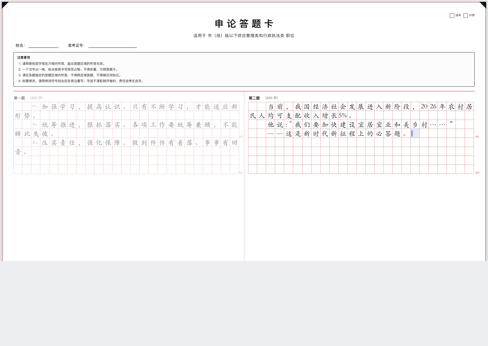
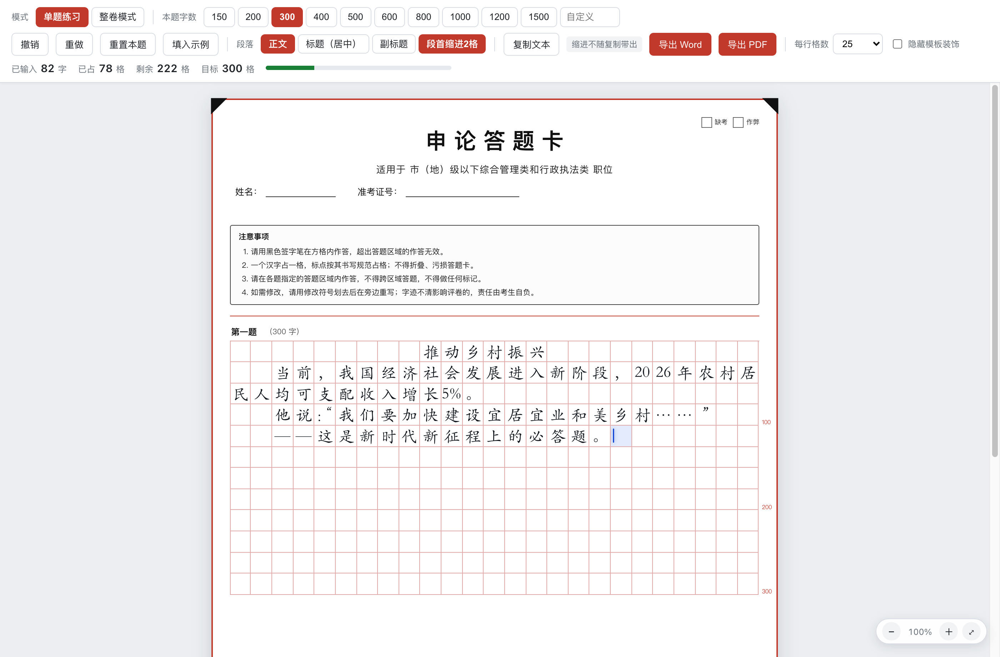

<div align="center">

# 申论电脑模拟答题卡

**在网页上还原公务员考试申论标准答题卡 —— 手写换成键盘打字，方格纸的书写规则一条不少。**

[](LICENSE)
[](../../actions/workflows/deploy.yml)
[](https://www.typescriptlang.org/)
[](../../pulls)

[](docs/hero.png)

</div>

---

## 这是什么

**给嫌手写刷申论太慢的人准备的模拟答题纸。**

申论一场要写两三千字，平时刷题光抄材料、数格子就占掉大半时间，手写速度往往还跟不上思路。
这个工具把「写」换成键盘打字，但排出来的**仍然是一张标准答题卡该有的样子**。

你不需要数格子、也不需要敲空格凑位置 —— 正常打字就行，
系统会逐字识别你输入的内容，按答题纸的书写规范决定它落在哪一格：

| 你打的 | 它排出来的 |
| --- | --- |
| `2026年` | `20` `26` `年` —— 连续数字两个占一格 |
| `他说：“好”` | `：“` 合并进同一格 —— 连续标点不散开 |

其余的同类规则（行末写不下句号时挤进前一格右下角、`——` `……` 绝不拆成两行、
大作文正文每段空两格而小题顶格）都一样，**不用记，也不用手动调**。

写完可以直接**复制文本**、**导出 Word**、**导出 PDF** —— 三者都是干净的文字版，不含任何方格。

> 这个工具**不是**把 PDF 当背景图，也不是「带红框的 textarea」：
> 逻辑文本与视觉格子完全分离，排版规则由一个独立的、可配置的规则引擎负责。
> 详见 [核心设计](#核心设计)。

---

## 三种使用方式

按你的情况挑一种就行。

### 🟢 方式一：在线版（最省事，推荐给所有人）

打开网址就能用，手机、平板、电脑都行，不用装任何东西：

```
https://murphy3569.github.io/shenlun-answer-sheet/
```

### 🟢 方式二：离线单文件版（推荐给不想联网、或上不了 GitHub 的人）

下载**一个 `.html` 文件**，双击打开就能用，**全程离线，不需要安装任何东西**：

1. 到 [Releases](../../releases) 页面下载 `shenlun-answer-sheet-*.html`
2. 放到桌面，双击（用 Chrome / Edge / Safari 打开都行）
3. 直接开始打字

> 文件约 5.6MB —— 里面内嵌了中文字体，这样导出的 PDF 才不会乱码。
> 作答内容完全在你自己电脑上，不会上传到任何地方。

### 🟡 方式三：从源码运行（开发者）

```bash
git clone https://github.com/Murphy3569/shenlun-answer-sheet.git
cd shenlun-answer-sheet
npm install
npm run dev          # 打开 http://localhost:5173
```

环境要求：**Node ≥ 22.22**（推荐 24 LTS）。测试环境用的 jsdom 30 要求
`^22.22.2 || ^24.15.0 || >=26.0.0`，Node 18 / 20 跑不起来。

---

## 界面截图

**整卷模式** —— A3 横向，左右两栏各是一道题的独立答题区，中间是竖向虚线。


**单题练习** —— 题目装得进一栏时用 A4 纵向，纸张缩小但格子大小不变，一栏到底、右边不留空。



**导出的 PDF** —— A4 纵向、标题居中、段首缩进，矢量文字可选中，不含任何方格。


---

## 核心设计

### 逻辑文本与视觉格子彻底分离

```
用户输入的逻辑文本（含真实换行）
        │
        ▼  tokenize()
     Token[]          逻辑单位：一个汉字 / 一串数字 / 一个破折号 / 一个复合标点
        │
        ▼  layoutBlock()   ← 全部排版规则都在这里
   Row[] / Cell[]       视觉单位：答题卡上的一个个方格
        │
        ▼  paginateBlocks()
  Panel[] / Page[]      面板（一道题的答题区）→ A4 纵向 / A3 横向页面
```

**Token 的边界和 Cell 的边界不要求一一对应**，这是整个设计的关键：

| 情形 | Token | 占用格子 |
| --- | --- | --- |
| 汉字 | `发` | 1 格 |
| 数字串 | `2026` | 2 格（`[20][26]`） |
| 破折号 | `——` | 2 格（行末可压缩显示为 1 格） |
| 复合标点 | `：“` | 1 格 |
| 行末挤占 | 汉字 + `。` 两个 Token | 共用 1 格 |

同一份逻辑文本，屏幕上渲染成方格，导出时还原成纯文字 —— 两条出口互不干扰。

键盘输入落在哪里？在 `components/EditorSurface.tsx` 里一个隐藏的原生 `textarea` 上：
中文输入法的组合与候选框位置全交给浏览器原生处理（组合期间绝不改动它的内容），
方格只是它的显示器，光标再映射回格子。所以它不是「带红框的 textarea」，方格也不是输入框本身。

### 目录结构

```
├── src/                     应用源码（见下）
├── docs/                    README 用的截图
├── scripts/
│   ├── build-pdf-font.md    内置 PDF 字体的构建方式（含两个必踩的坑）
│   └── vite-plugin-licenses.ts  构建时把许可证随产物一起发出去（OFL 要求）
├── LICENSES/
│   └── OFL-NotoSerifSC.txt  内置字体的 OFL 许可证全文
├── .github/workflows/
│   └── deploy.yml           自动部署 Pages + 打 tag 时发布离线单文件版
├── LICENSE  NOTICE          本项目 MIT 许可证 / 第三方组件声明
├── vite.config.ts           常规构建
└── vite.config.singlefile.ts 离线单文件构建

src/
├── layout/                  排版引擎（纯 TypeScript，零依赖，零 DOM）
│   ├── types.ts             全部数据结构：Token / Cell / Row / Panel / Page / LayoutProfile
│   ├── punctuationRules.ts  标点分类表 + 复合标点组合表（国标层 + 申论适配层）
│   ├── numberRules.ts       数字 / 英文分组与切分规则
│   ├── profile.ts           LayoutProfile 默认值与三套预设
│   ├── tokenizer.ts         逻辑文本 → Token
│   ├── lineBreakRules.ts    「放不下的时候怎么办」：禁则、挤占、压缩、拆分的判定
│   ├── cellAllocator.ts     「Token 落到格子」的几何原语
│   ├── layoutEngine.ts      编排：段落循环 + 分页
│   ├── caret.ts             文本 offset ↔ 方格 的双向映射
│   └── index.ts             对外出口
├── document/model.ts        文档模型：题块 / 段落 / 段落样式；纯文本导出
├── export/
│   ├── exportDocx.ts        Word 导出（docx）
│   ├── exportPdfDirect.ts   PDF 导出（pdf-lib + 内置字体子集，一键下载）
│   ├── exportPdf.ts         PDF 导出兜底（打印版 HTML）
│   └── pdfFontCharset.ts    内置字体覆盖的字符集（导出前查冷僻字）
├── components/
│   ├── SheetView.tsx        页面 / 面板 / 行 / 格 的渲染
│   ├── cellGlyphs.ts        格内字形的视觉排布（含行末共格专用布局）
│   ├── glyphMetrics.ts      用 canvas 实测字形墨迹位置（不猜字体度量）
│   └── EditorSurface.tsx    隐藏的原生 textarea —— 输入法安全的输入层
├── sheet/geometry.ts        答题卡几何：A3/A4 两种纸张、方格边长、每面板行数、版式选择
├── styles/                  app.css / sheet.css / print.css
└── App.tsx                  状态编排与事件转发（不含任何排版规则）
```

**规则全部集中在 `src/layout/`，组件里没有一行排版判断。**
要改规则，只改 `LayoutProfile` 或 `punctuationRules.ts`，UI 一行都不用动。

---

## 排版规则

最容易搞混的一点是：**「国家标准」和「申论方格纸的书写约定」不是一回事**，本项目严格分成两层。

### 第一层：基础规范（GB/T 15834-2011 + W3C clreq）

| 规则 | 内容 |
| --- | --- |
| 标点分类 | 句末点号 `。！？`、句内点号 `，、；：`、开标号 `“‘（〔［【《〈`、闭标号 `”’）〕］】》〉`、破折号、省略号、连接号、间隔号、分隔号 |
| 行首禁则 | 句末点号、句内点号、闭标号、分隔号**禁止出现在行首** |
| 行尾禁则 | 开标号、分隔号**禁止出现在行尾** |
| 破折号 | `——` 占 **2** 个字位置，**内部不可断开**分处两行（§5.1.4） |
| 省略号 | `……` 占 **2** 个字位置，内部不可断开（§5.1.5） |
| 叠用点号 | 两个叠用（`？？` `！！` `？！`）占 **1** 个字位置；三个叠用（`？？？` `！！！`）占 **2** 个（§5.1.2，明文，禁止外推成 1.5 格） |
| 开闭配对 | 开标号与闭标号**各占一个字位置**，绝不压缩成同格（压了会拼成镜像图样，无法辨读） |

### 第二层：申论方格纸书写约定（培训/考场约定，**不是**国标）

| 规则 | 内容 |
| --- | --- |
| 数字两两成组 | `2026 → [20][26]`；奇数长度末位独占一格（`10000 → [10][00][0]`） |
| 英文两两成组 | `ISO9001 → [IS][O9][00][1]` |
| 连续标点同格 | `：“`、`。”`、`”。`、`？！` 等压进同一格 |
| 行末标点挤占 | 行已写满时，句末点号写在前一格的**右下角**，与汉字共格 |
| 行末宽标号压缩 | 行末只剩 1 格时，`——` / `……` 整体压进这一格 |
| 段首缩进 | 大作文、应用文正文每段空两格；归纳概括等小题**顶格不缩进** |

想改哪条规则，只改 profile；引擎不需要动。

### 配置化

所有会影响排版的规则都在 `LayoutProfile` 里，引擎不含任何写死的规则数值：

```ts
import { createDefaultProfile, withProfile, layoutBlock } from './src/layout'

const myProfile = withProfile(createDefaultProfile(), {
  columns: 25,                     // 每行格数
  arabicDigitsPerCell: 2,          // 几个数字占一格
  englishCharsPerCell: 2,          // 几个英文字母占一格
  dashWidth: 2,                    // 破折号占几格
  ellipsisWidth: 2,                // 省略号占几格
  normalPunctuationWidth: 1,       // 普通中文标点占几格
  compoundPunctuation: false,      // 关掉「连续标点同格」
  endOfLinePunctuationCompression: false, // 关掉「行末标点挤占」
  lineEndStrategy: 'pull-down',    // 行末策略：squeeze / pull-down / allow
  compressWideTokenAtLineEnd: true,// 行末只剩 1 格时压缩破折号/省略号
  keepNumberIntact: true,          // 数字串不可被换行打断
  keepEnglishIntact: true,         // 英文串不可被换行打断
  pairArabicDigits: true,          // 数字两两成组（false = 一个数字一格）
  allowOpeningPunctuationAtLineStart: true,  // 开引号允许起行
  preventClosingPunctuationAtLineStart: true,// 闭引号禁止起行
  preventOpeningPunctuationAtLineEnd: true,  // 开引号禁止收尾
  autoIndentFirstLine: false,      // 关掉段首缩进
  defaultIndentCells: 2,
  milestoneStep: 100,              // 每满多少格在行末标注一次（0 = 不标）
})

const result = layoutBlock({ blockId: 'q1', blockTitle: '第一题', text, capacity: 300 }, myProfile)
```

内置三套预设（`LAYOUT_PRESETS`）：

| 预设 | 说明 |
| --- | --- |
| `shenlun` | **默认**。国标 + 申论方格纸约定 |
| `strictGb` | 严格国标横排：不做任何方格纸压缩，标点一律独立占格 |
| `plain` | 原样排布：一个字符一格，不缩进、不配对数字、不压缩标点 |

**所有字段都真的被引擎读取**，并且都有测试证明「改了排版结果确实会变」——
覆盖这些字段的用例分别在 `src/layout/configSwitches.test.ts` 与 `src/layout/avoidance.test.ts`
（含 `normalPunctuationWidth` / `dashChar` / `ellipsisChar` / `keepNumberIntact` 这类容易写成死开关的项）。

---

## 导出

四个出口，**都只导出你真正输入的内容**，不含任何方格：

| 出口 | 说明 |
| --- | --- |
| 复制文本 | 当前这道题的原文，不含方格与自动折行 |
| 复制整卷 | 整卷所有题目的原文，每题前面带「【第一题】」这样的题号（只有一道题时不加） |
| 导出 Word | 一键下载 `.docx`。纯文字，正文仿宋三号、标题小标宋二号，**保留段首缩进** |
| 导出 PDF | 一键下载 A4 纵向 PDF。矢量文字，可选中、可检索，放大不糊 |

段首缩进是**排版格式**而不是空格字符，所以「复制文本」带不出去（工具栏上就有提示）；
要保留缩进请用「导出 Word」或「导出 PDF」。

> **PDF 约 1.8MB。** 里面整份嵌入了一款中文字体 ——
> 这样在任何设备、任何阅读器上打开都不会乱码，写多长、多少页都不影响这个体积。

内置字体覆盖 **GB2312 全集 + ASCII + 中文标点与常用符号**，
[GB/T 15834-2011](https://openstd.samr.gov.cn/)《标点符号用法》里规定的标点**一个不缺**。
万一你的作答里出现了字体没有的字（一般只有按 Option 组合键打出的 `©` `™` 或生僻字才会），
导出 PDF 会**自动改用打印版**，并在提示里带码点告诉你是哪几个（例如 `© U+00A9`），
不会在 PDF 里留下空白或豆腐块。

---

## 常见问题

**Q：复制到 Word 里，段首缩进不见了？**
段首缩进是**排版格式**而不是空格字符，纯文本复制带不过去（「复制文本」按钮旁边就写着「缩进不随复制带出」）。
需要保留缩进请用「导出 Word」或「导出 PDF」。

**Q：导出的 PDF 为什么有 1.8MB？**
因为整份嵌入了中文字体，这样在任何阅读器上打开都不会乱码。字体是固定成本，
正文写多长、页数多少都不影响这个体积。

**Q：我的作答会上传到服务器吗？**
不会。这个工具**没有任何后端**，全部逻辑跑在浏览器里，作答内容只存在于你自己的设备上。

**Q：能改成一页 A4 或者别的版式吗？**
可以。页面几何集中在 `src/sheet/geometry.ts`，字号与配色在 `src/styles/`，
规则在 `LayoutProfile` —— 都不需要动引擎。

**Q：我的考试答题卡规则和默认的不一样怎么办？**
改 `LayoutProfile` 就行，常见差异（每行格数、数字几个一格、行末策略、是否压缩标点）
都有对应开关，不用改代码逻辑。详见 [配置化](#配置化)。

**Q：单题练习有时是 A4 纵向、有时是 A3 横向？**
单题练习会先试着把这道题放进**一栏**—— 装得下就用 A4 纵向（一栏到底，右边不留空）；
装不下（比如 800 字大作文）才回到 A3 横向的左右两栏，那样一页能放下更多内容。
整卷模式始终 A3 横向。改「本题字数」或「每行格数」时这个判断会自动重算。

**注意格子大小不会变**：两种版式的栏宽都是 196 mm，所以每行 25 格时格子永远是 7.84 mm，
换版式只是换了纸张大小。

**Q：手机上能用吗？**
可以，用手机浏览器打开在线版即可。界面按窗口宽度自适应缩放。

---

## 开发

```bash
npm install

npm run dev              # 开发服务器 http://localhost:5173
npm test                 # 跑全部自动化测试（335 项）
npm run test:watch       # 监听模式
npm run typecheck        # 类型检查
npm run build            # 生产构建（产物在 dist/）
npm run build:singlefile # 构建离线单文件版（产物在 dist-single/index.html）
npm run preview          # 预览生产构建
npm run verify           # 一条命令跑完：类型检查 + 全部测试 + 生产构建
```

---

## 第三方组件与许可

本项目以 **MIT** 许可证发布（见 [LICENSE](LICENSE)）。

需要单独说明的是内置字体：

| 组件 | 用途 | 许可 |
| --- | --- | --- |
| [Noto Serif SC](https://github.com/googlefonts/noto-cjk) 子集 | 导出 PDF 时内嵌的中文字体 | **SIL OFL 1.1**（见 [LICENSES/OFL-NotoSerifSC.txt](LICENSES/OFL-NotoSerifSC.txt)） |
| React / Vite / pdf-lib / docx / Vitest 等 | 运行时与构建依赖 | MIT 等宽松许可，版权归各自作者 |

> 字体文件以 OFL 分发，MIT 许可证不覆盖它。OFL 允许自由使用、修改、再分发（含随商业软件分发），
> 但要求保留版权声明与许可证全文。详见 [NOTICE](NOTICE)。

字体子集的构建方式（含为什么要用 TrueType 而不是 CFF、
为什么不能用 pdf-lib 的二次子集化）见 [`scripts/build-pdf-font.md`](scripts/build-pdf-font.md)。

---

<div align="center">

如果这个工具帮到了你，给个 ⭐ 让更多备考的人看到。

</div>
